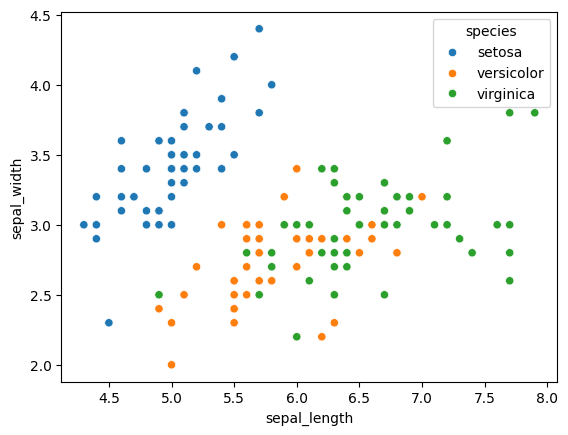
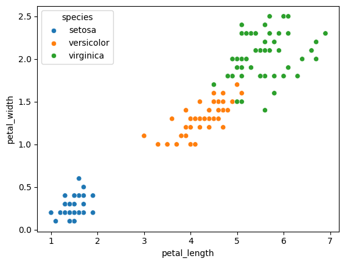
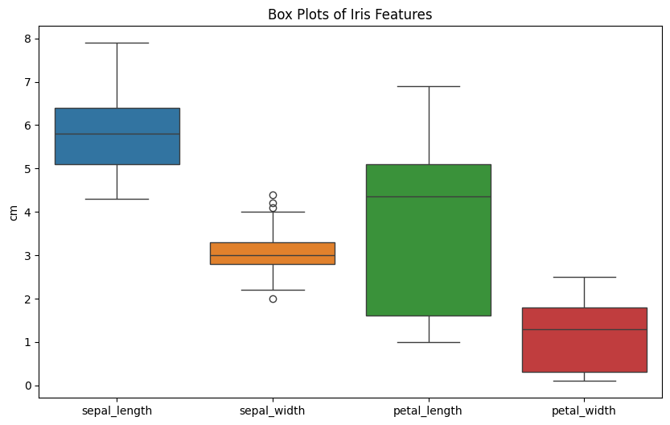

# 🌸 Task 1 – Exploring Iris Dataset

This task focuses on **Exploratory Data Analysis (EDA)** of the classic **Iris dataset** 🌱.  
The aim is to deeply understand the dataset through **statistical summaries**, **visualizations**, and **pattern discovery** before moving on to any machine learning modeling.

---

## 🎯 Objectives
- 📥 **Load & Inspect** the Iris dataset  
- 📊 **Generate Statistical Insights** (mean, median, standard deviation)  
- 📉 **Visualize Distributions** using histograms  
- 🔍 **Explore Relationships** with scatter plots  
- 🚦 **Detect Outliers** using box plots  

---

## 📂 Folder Contents
- 📒 **task1_iris_eda.ipynb** → Main Jupyter Notebook containing implementation  
- 🖼 **results/** *(optional)* → Saved plots (scatter, histograms, boxplots) for easy reference  

---

## 🚀 How to Run
1. 📂 **Open Notebook:** Launch `task1_iris_eda.ipynb` in **Jupyter Notebook**  
2. ▶️ **Run Cells:** Execute each cell step by step  
3. 👀 **Analyze Results:** Review:
   - 📊 **Scatter plots** – feature relationships  
   - 📈 **Histograms** – feature distributions  
   - 📦 **Box plots** – outlier detection  

---

## 📸 Sample Output

| Visualization | Example |
|--------------|---------|
| 🌱 **Scatter Plot** |  |
| 📈 **Histogram**  |  |
| 📦 **Box Plot**   |  |

---

## 🛠 Tech Stack
- 🐍 **Language:** Python  
- 📚 **Libraries:** `pandas`, `matplotlib`, `seaborn`  

---

✅ **Outcome:** This task demonstrates key **EDA techniques** and builds a strong foundation for data-driven decision-making before model training.

---

## 📫 Contact

Connect with me professionally or reach out via email:

- **LinkedIn:** [Andreyas](www.linkedin.com/in/eng-andreyas)  
- **Email:** eng.andreyas@gmail.com

## ✅ Status
**Task Completed Successfully** – all models trained, predictions evaluated, and results visualized.

