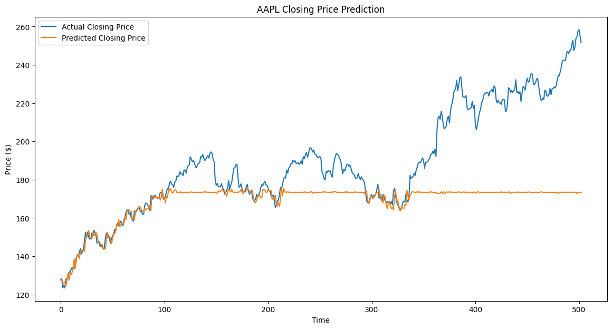
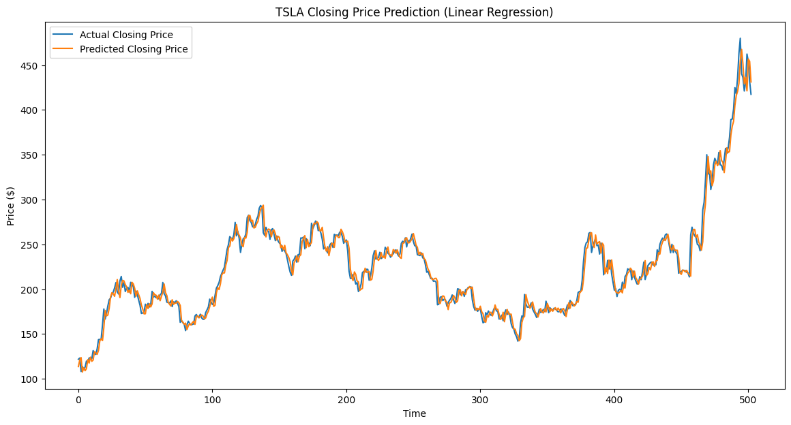

# 🌟 Task 2 – Short-Term Stock Price Forecasting

This task focuses on predicting **next day stock closing prices** using historical stock data from **Yahoo Finance** 📈.  
The aim is to explore **time series regression**, build machine learning models, and visualize predicted vs actual stock prices.

---

## 🎯 Objectives
- 📥 **Load & Inspect** historical stock data using `yfinance`  
- 📊 **Prepare Features** for regression (`Open`, `High`, `Low`, `Volume`)  
- 🤖 **Train Models** — Random Forest Regressor & Linear Regression  
- 📉 **Evaluate Predictions** using Mean Squared Error (MSE)  
- 📈 **Visualize Results** — compare predicted vs actual closing prices  

---

## 📂 Folder Contents
- 📒 **stock_price_prediction.ipynb** → Jupyter Notebook with full implementation  
- 🖼 **results/** *(optional)* → Saved plots of stock price predictions for easy reference  

---

## 🚀 How to Run
1. 📂 **Open Notebook:** Launch `stock_price_prediction.ipynb` in **Jupyter Notebook**  
2. ▶️ **Run Cells:** Execute sequentially to load data, train models, and generate predictions  
3. 👀 **Analyze Results:** Review:
   - 📊 **Model Metrics** — Mean Squared Error (MSE)  
   - 📈 **Plots** — Predicted vs Actual Closing Prices for Apple (AAPL) and Tesla (TSLA)  

---

## 📸 Sample Output

| Visualization | Example |
|--------------|---------|
| 🍎 **AAPL Prediction** |  |
| 🚗 **TSLA Prediction** |  |

---

## 🛠 Tech Stack
- 🐍 **Language:** Python  
- 📚 **Libraries:** `yfinance`, `pandas`, `scikit-learn`, `matplotlib`  

---

## 📫 Contact
- **LinkedIn:** [Andreyas](www.linkedin.com/in/eng-andreyas)  
- **Email:** eng.andreyas@gmail.com  

---

## ✅ Status
**Task Completed Successfully** – all models trained, predictions evaluated, and results visualized.

